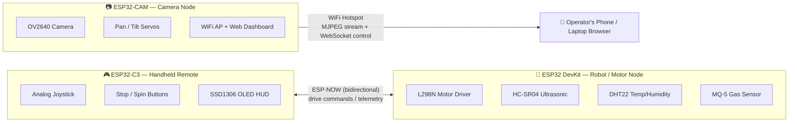
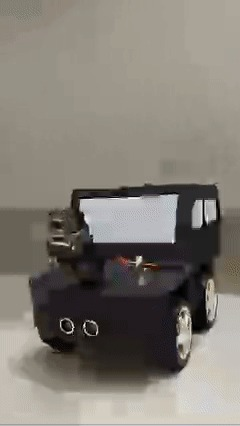
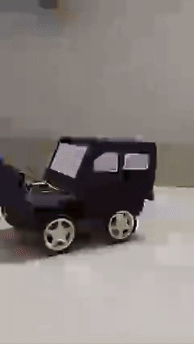
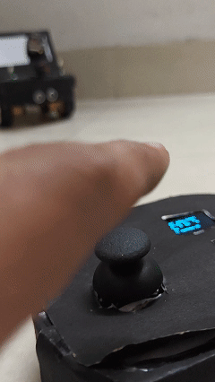
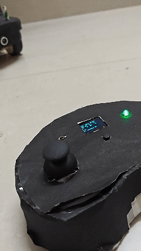

<div align="center">

# 🔥 PHOENIX
### Wireless Rescue Robot with Live Streaming & Environment Monitoring

*Built to protect. Designed to survive.*


[Overview](#overview) • [Architecture](#system-architecture) • [Hardware](#hardware) • [Getting Started](#getting-started) • [Wiring](#wiring--pinouts) • [Usage](#usage) • [Media](#media) • [Team](#team)

</div>

---

## Overview

**Phoenix** is a low-cost, zero-infrastructure wireless rescue robot designed to navigate hazardous
environments — disaster zones, fire sites, and gas-leak areas — where sending a human first is too
dangerous. It streams live video, monitors gas/temperature/obstacle conditions in real time, and is
fully controllable from a dedicated handheld remote and a mobile-friendly web dashboard.

No router, no internet connection, and no external server are required — every node builds its own
link on the spot.

**Built for:** Tech Sangram — Battle of Innovation, Haridwar University, Roorkee
**Team:** Team Sentinel

### Key Features

- 📡 **Dual wireless links running simultaneously** — ESP-NOW for ultra-low-latency bidirectional
  control/telemetry, and a self-hosted WiFi access point for live MJPEG video streaming
- 🎮 **Handheld remote** with analog joystick driving, one-tap 360° spin macro, panic-stop button,
  and a live OLED HUD (distance, temperature, gas level, danger rating, motor speeds)
- 📷 **Pan/Tilt streaming camera turret** controlled from a browser-based dashboard, with flash LED
  and low-latency MJPEG streaming over a dedicated WebSocket control channel
- 🌡️ **Real-time environment monitoring** — ultrasonic obstacle detection, DHT22 temperature, and
  MQ-5 gas sensing with an automatic LOW / MED / HIGH danger classification
- 🛡️ **Active safety braking** — the drivetrain automatically brakes when an obstacle is detected
  within 30 cm while moving forward
- 🧩 **Zero single point of failure** — each of the three ESP32 nodes runs fully independently

---

## System Architecture



| Node | Board | Role |
|---|---|---|
| **Robot Node** | ESP32 DevKit | Drives the L298N motor driver, reads ultrasonic/temperature/gas sensors, runs the obstacle-braking safety logic, talks to the remote over ESP-NOW |
| **Handheld Remote** | ESP32-C3 SuperMini | Reads the joystick/buttons, renders live telemetry on an OLED display, sends drive commands over ESP-NOW |
| **Camera Node** | ESP32-CAM (AI-Thinker) | Hosts its own WiFi access point, serves the live web dashboard, streams MJPEG video, and drives the pan/tilt turret servos |

---

## Hardware

| Component | Used for |
|---|---|
| ESP32 DevKit V1 | Robot/motor controller node |
| ESP32-C3 SuperMini | Handheld remote controller |
| ESP32-CAM (AI-Thinker, OV2640) | Live video streaming + pan/tilt turret |
| L298N Dual H-Bridge Motor Driver | 4x DC gear motor control |
| HC-SR04 | Ultrasonic obstacle detection |
| DHT22 | Ambient temperature/humidity |
| MQ-5 | LPG / combustible gas detection |
| 2x SG90 Micro Servos | Camera pan & tilt turret |
| SSD1306 128x64 I2C OLED | Remote HUD display |
| Analog joystick module | Drive input |
| Buzzer + 2x status LEDs | Remote feedback |
| 4WD chassis, wheels, battery pack | Drivetrain |

> Full bill of materials, wiring photos, and the original project poster are in [`docs/`](docs/).

---

## Repository Structure

```
phoenix-rescue-robot/
├── firmware/
│   ├── esp32devkit_car_node/     # Robot motor + sensor controller
│   │   └── PHOENIX_CAR.ino
│   ├── esp32c3_remote_node/      # Handheld remote controller
│   │   └── PHOENIX_REMOTE.ino
│   └── esp32cam_node/            # Camera + web dashboard node
│       └── PHOENIX_CAM.ino
├── docs/
│   ├── images/                   # Build photos
│   └── media/                    # Demo GIFs
├── LICENSE
├── .gitignore
└── README.md
```

> **Note on firmware versions:** the camera node firmware (`PHOENIX_CAM.ino`) is treated as final.
> The car and remote node firmware are still being iterated on and may be swapped for improved
> versions — the copies committed here are the current preferred/default versions.

---

## Getting Started

### 1. Prerequisites

- [Arduino IDE](https://www.arduino.cc/en/software) (2.x recommended) with the **ESP32 board package**
  installed via Boards Manager (`esp32` by Espressif Systems)
- Board selection per node:
  - Robot node → **ESP32 Dev Module**
  - Remote node → **ESP32C3 Dev Module** (USB CDC On Boot: Enabled)
  - Camera node → **AI Thinker ESP32-CAM**

### 2. Required Libraries

Install via Library Manager unless noted:

| Node | Libraries |
|---|---|
| Car | `ESP32` core (`esp_now`, `WiFi`), [`DHT sensor library`](https://github.com/adafruit/DHT-sensor-library) (Adafruit) + `Adafruit Unified Sensor` |
| Remote | `ESP32` core (`esp_now`, `WiFi`, `Wire`), [`Adafruit SSD1306`](https://github.com/adafruit/Adafruit_SSD1306), `Adafruit GFX Library` |
| Camera | `ESP32` core (`esp_camera`, `WiFi`, `ESPmDNS`), `WebServer` (bundled), [`arduinoWebSockets`](https://github.com/Links2004/arduinoWebSockets) (Markus Sattler), [`ESP32Servo`](https://github.com/madhephaestus/ESP32Servo), [`ArduinoJson`](https://arduinojson.org/) (v6.x)

### 3. Pair the MAC addresses (required before first use)

The car and remote talk directly over ESP-NOW, so each one needs to know the other's WiFi MAC
address **before** they can pair:

1. Flash both boards once with their firmware as-is, open Serial Monitor at `115200` baud, and note
   the `MAC:` line each prints on boot.
2. In `firmware/esp32devkit_car_node/PHOENIX_CAR.ino`, set `remoteMac[]` to the **remote's** MAC.
3. In `firmware/esp32c3_remote_node/PHOENIX_REMOTE.ino`, set `carMac[]` to the **car's** MAC.
4. Re-flash both boards.

### 4. Flash order

1. **Camera node** — flash `esp32cam_node/PHOENIX_CAM.ino` (needs an FTDI/USB-serial adapter for the
   AI-Thinker board; hold `IO0` to `GND` while resetting to enter flash mode).
2. **Car node** — flash `esp32devkit_car_node/PHOENIX_CAR.ino` directly over USB.
3. **Remote node** — flash `esp32c3_remote_node/PHOENIX_REMOTE.ino` directly over USB.

---

## Wiring & Pinouts

### Robot / Motor Node (ESP32 DevKit)

| Function | Pin |
|---|---|
| Right motors — IN1 / IN2 / ENA | G18 / G19 / G14 |
| Left motors — IN3 / IN4 / ENB | G25 / G26 / G13 |
| HC-SR04 — TRIG / ECHO | G27 / G33 |
| DHT22 data | G4 |
| MQ-5 analog out | G34 |
| Status LED | G2 |
| UART to camera node — RX / TX | G16 / G17 |

### Handheld Remote (ESP32-C3)

| Function | Pin |
|---|---|
| Joystick VRX (forward/back) | GPIO 1 |
| Joystick VRY (turn) | GPIO 2 |
| Joystick switch | GPIO 3 |
| Buzzer | GPIO 4 |
| Stop button | GPIO 5 |
| 360° spin button | GPIO 6 |
| Yellow LED (searching) | GPIO 20 |
| Green LED (connected) | GPIO 21 |
| OLED SDA / SCL | GPIO 8 / GPIO 9 |

### Camera Node (ESP32-CAM)

| Function | Pin |
|---|---|
| Flash LED | GPIO 4 |
| Pan servo | GPIO 2 |
| Tilt servo | GPIO 14 |
| UART from car node — RX / TX | GPIO 13 / GPIO 12 |

Camera data pins follow the standard AI-Thinker ESP32-CAM pinout (see top of
[`PHOENIX_CAM.ino`](firmware/esp32cam_node/PHOENIX_CAM.ino)).

---

## Usage

1. Power on the robot (car node) and the camera node, then power on the handheld remote.
2. The remote auto-calibrates the joystick center on boot — **keep it untouched** during the
   "Calibrating..." OLED message.
3. Green LED on the remote = paired with the car. Yellow blinking = still searching.
4. Drive with the joystick (tank-mix differential steering); hold the joystick button or press the
   **STOP** button to halt; press the **360°** button for a one-tap full spin.
5. On your phone or laptop, connect to the WiFi network **`PHOENIX_CAM`** (password `12345678`) and
   open **`http://192.168.4.1`** in a browser for the live video feed and pan/tilt/flash controls.
6. The remote's OLED continuously shows distance, temperature, gas level, danger rating, and current
   motor speeds, and beeps on obstacle or high-danger warnings.

> Default AP credentials and IP are set in `firmware/esp32cam_node/PHOENIX_CAM.ino` — change them
> before any public demo if you don't want them guessable.

---

## Media

<table>
<tr>
<td width="25%"></td>
<td width="25%"></td>
<td width="25%"></td>
<td width="25%"></td>
</tr>
<tr>
<td align="center">Front view</td>
<td align="center">Side profile</td>
<td align="center">Joystick driving</td>
<td align="center">Remote HUD live</td>
</tr>
</table>

More build photos, the mobile dashboard screenshot, the original project poster, and demo clips
are in [`docs/images/`](docs/images/) and [`docs/media/`](docs/media/).

---

## Roadmap

- [ ] Autonomous navigation mode
- [ ] Thermal imaging integration
- [ ] AI-based hazard classification
- [ ] Encrypted ESP-NOW pairing

---

## Team

**Team Sentinel** — Haridwar University, Roorkee

- Manish Kumar Mahato
- Shivansh Khare
- Paswan Adityaraj Rajkumar
- Vedansh Tonk

---

## License

Released under the [MIT License](LICENSE).
